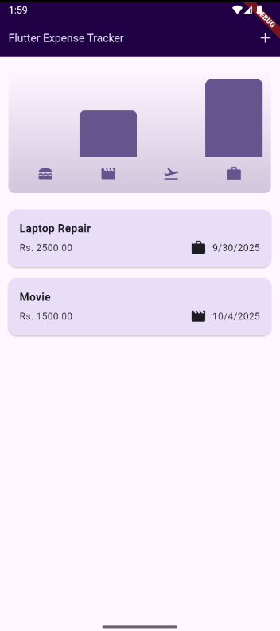
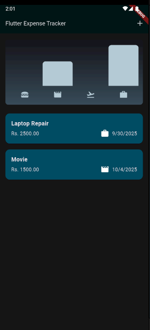
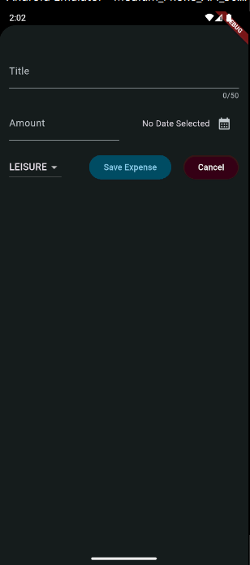
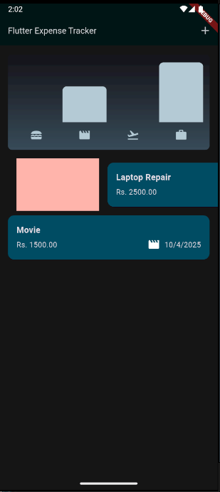
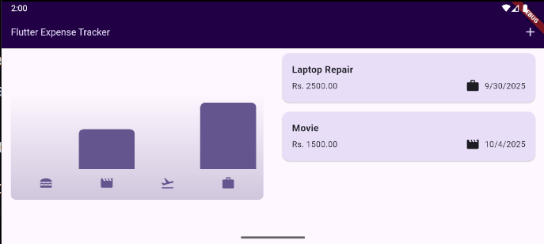

  <h1>💰 Flutter Expense Tracker</h1>
  
  

    <strong>A clean, modern expense tracking mobile app built with Flutter</strong> 
    Track your daily expenses, visualize spending with charts, save data persistently with SQLite, and enjoy a beautiful dark mode experience.
  

 

## ✨ Features

- 📊 **Interactive Bar Chart** – Weekly spending overview with category icons
- ➕ **Add / Delete Expenses** – Title, amount, date & category selection
- 💾 **Persistent Storage** – All expenses saved locally using **SQLite**
- 🌙 **Dark Mode** – Beautiful dark theme (system / manual toggle support)
- 🔄 **Screen Rotation Support** – Works in both portrait & landscape
- 🏷️ **Category Icons** – Food, entertainment, travel, work, etc.
- ⚡ **Smooth UI/UX** – Material 3 design with clean animations

 

## 📸 Screenshots

Here are some glimpses of the app:

  
  
  
  
  

